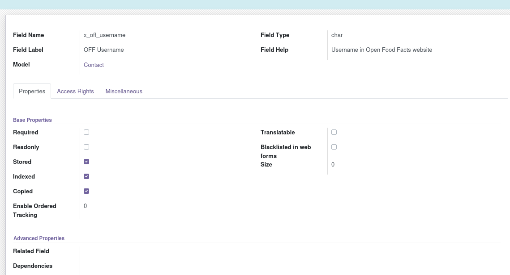
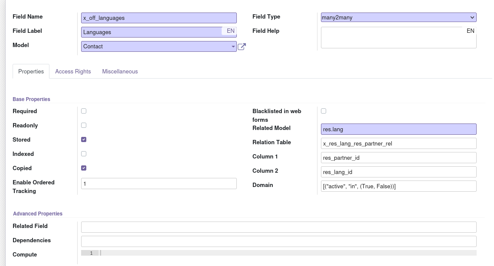
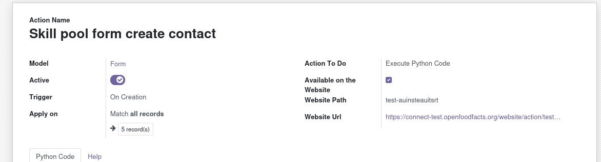
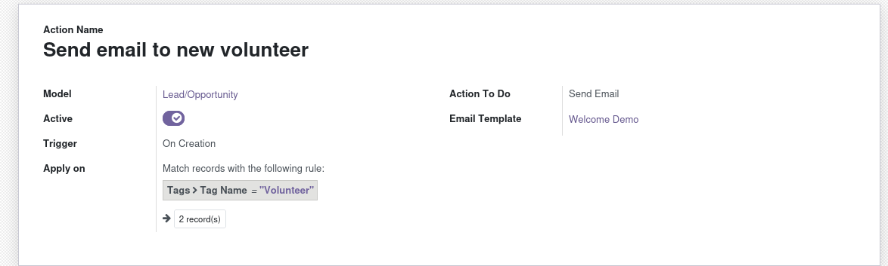
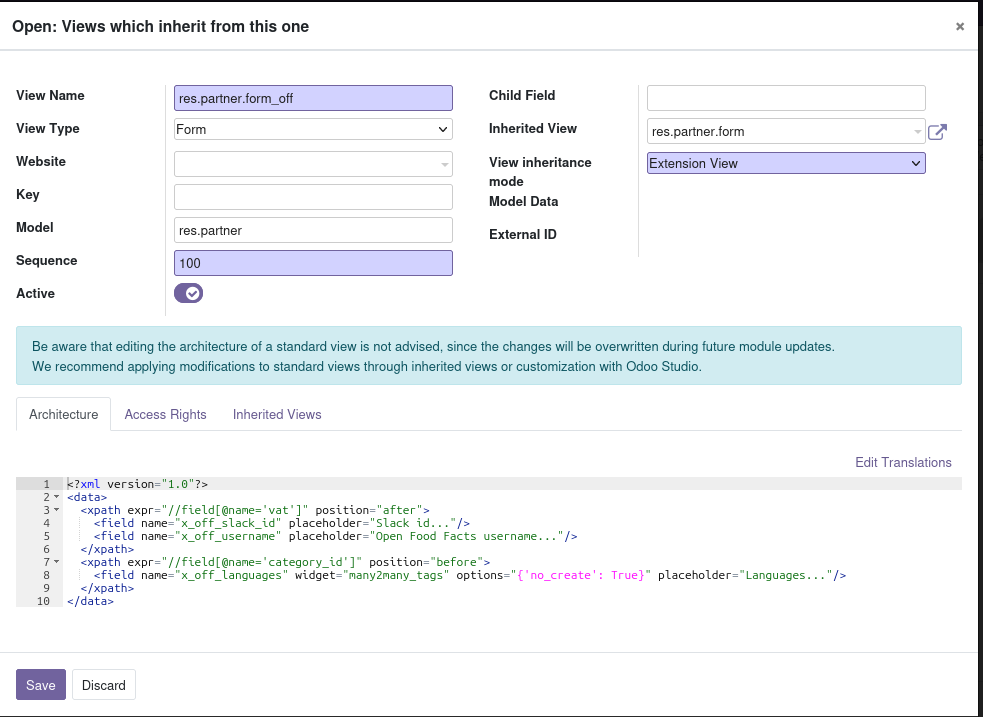

# Skill pool

Here are snippets used to create the skill-pool.

**Important:** when using Form Builder in odoo 15, only formio 4.15.0-rc.13 is working !

Might be great to transform that in an internal product at some point (off internal product).

For the redirect url to work, you have to build a page where you will include the skill pull form through an iframe, and add an event on page.
* create a web page on the website
* in the page, add a "Embed Code" block with:
  ```
    <script type="text/javascript">
      window.addEventListener(
        "formioSubmitDone",
        (event) => {
            document.location.href = event.data.submit_done_url;
        },
        false,
      );
    </script>
        <iframe id="formio" src="/formio/public/form/create/FORM-UUID>" width="100%" height="800px" frameborder="0" allowfullscreen="">
    </iframe>
  ```
* use this page for user to edit the form.

# Some notes on how I created the form

## Made internal notes the default displayed tab (instead of contacts).

* go dev mode (?debug=1)
* I get on a contact form
* on the “bug”/dev menu, clicked Edit View: Form
* in architecture XML, looked for the `<notebook>` element and the `<page>` inside
* changed  autofocus=”autofocus” from page contacts to page internal notes:
  `<page name="internal_notes" string="Internal Notes" autofocus="autofocus">`

## Adding simple fields (slack_id, off_username)

On contact view, use bug/dev menu, View fields
Created`x_off_slack_id`and`x_off_username`as char fields

Then on the form, the “bug/dev” edit view: form and add this line:
`<field name="x_off_slack_id" placeholder="Slack id..."/>`
`<field name="x_off_username" placeholder="Open Food Facts username..."/>`

## Adding new spoken languages fields (many2many):

* searched for modules doing this but didn’t find any… (one on OCA but it’s only for employee)
* to get the model corresponding tot languages (DONE IN TEST first):
  * looking at the “lang” field didn’t help (it’s a select… no trace of the model)
  * i searched in settings and found “manage language”, in the url I see *model=res.lang*
  * added the field using the bug/dev menu *view fields*, and create: 
    see how Domain is used, because by default odoo filters on active only
    I also enabled order tracking
  * then got on a contact and used the “bug/dev” edit view: form and add this line:
    `<field name="x_off_languages" widget="many2many_tags" options="{'no_create': True, 'active_test': False}" placeholder="Languages..."/>`
  * see this nice reference about`many2many_tags`field: [https://ludwiktrammer.github.io/odoo/form-widgets-many2many-fields-options-odoo.html](https://ludwiktrammer.github.io/odoo/form-widgets-many2many-fields-options-odoo.html)

## Creating the form using web page edition (failure)

I tried to create the form to add a contact using the web page edition \+ add a form.
But this is far too limited. We only can add simple select and checkboxes, it makes the form really cumbersome and not welcoming to users. The number of thing than can be done is really limited and didn’t find any way to extend it

## Creating the form using FormBuilder

Another tool is installed on the test instance which is called FormBuilder.
There is absolutely no documentation on this and it’s far from easy to understand how to use it. The best clue are the screenshots on the product presentation page that you can find here: [https://github.com/novacode-nl/odoo-formio/tree/16.0/formio/static/description](https://github.com/novacode-nl/odoo-formio/tree/16.0/formio/static/description)

This is not to be confused (as I did) with the web form editor, which looks alike, but is absolutely disconnected from this other product.
This addon does not have integration to the web page, you instead obtain a very distinctive link to your form. The advantage is that it stores answers as JSON from which you can create new objects through a script.
I tried my best to build a form but it didn’t work until I realize the problem was in the javascript itself. It was the release used which was wrong.
In Forms, using the view Configuration / [formiojs versions (github tags)](https://connect-test.openfoodfacts.org/web#cids=1&menu_id=338&action=480&model=formio.version.github.tag&view_type=list),  I installed an 4.x version (the [4.15.0-rc.13 version](https://connect-test.openfoodfacts.org/web#id=3&cids=1&menu_id=338&action=479&model=formio.version&view_type=form)). And using this one, the form worked \!
Note: to add versions you have to go to settings / forms

I also looked at the source code to understand how to use the “API” thing, I was hopping to “fill” options for select box using it. **But this is not meant for this \!** It’s the contrary, it’s to eventually change or add values on server side after form validation \!
The documentation is in the `./formio_data_api/models/formio_form.py` `_etl_odoo_data` docstring !
The way it works is that you can run a python script that fills the “values” dict. This can then be used this way:

*`server_api`of a component must mach you api name
* value of`server_api_value`will be seeked in values
* if there is a`server_api_value_obj`it will try to find this property (of follow a chain of properties) in the resulting object

Finally I decided to go with formio. So I created (in test) a form using the builder.
I verified that strings are translatable to french, which is great news.

To have a json list of languages, I finally go to settings, [manage languages](https://connect-test.openfoodfacts.org/web/#cids=1&menu_id=4&action=56&active_id=63&model=res.lang&view_type=list) and export all to a excel, and the use a function like:
\=CONCATENER(G1;"{""label"":""";A2;""",""value"":""";C2;"""},
")
to build a JSON of values.
I did the same for countries using Contacts \--\> Configuration \--\> Localization → [countries](https://connect.openfoodfacts.org/web#cids=1&menu_id=111&action=65&model=res.country&view_type=list)

## Python Action to create contact and lead

Now I have to add the action triggered on form data creation.
Started here: [https://connect-test.openfoodfacts.org/web?debug=1\#id=3\&cids=1\&menu_id=4\&action=515\&model=base.automation\&view_type=form](https://connect-test.openfoodfacts.org/web?debug=1#id=3&cids=1&menu_id=4&action=515&model=base.automation&view_type=form)

A trick is to make the action accessible to the web and use this to trigger a specific test while you try to code it \!
[Odoo API documentation is useful](https://www.odoo.com/documentation/16.0/developer/reference/backend/orm.html#reference-orm-domains) as well as the [formio object model](https://github.com/novacode-nl/odoo-formio/blob/15.0/formio/models/formio_form.py)

To get tags:
sudo \-u postgres psql crm
select id, name from`crm_tag`where name ilike 'team %' or name ilike 'volunteer' or name ilike '%ly';
select id, name from`res_partner_category`where name ilike 'team %' or name ilike 'volunteer' or name ilike '%ly';

Editing many2many fields: see [https://odoo-development.readthedocs.io/en/latest/dev/py/x2many.html](https://odoo-development.readthedocs.io/en/latest/dev/py/x2many.html) and [https://www.odoo.com/documentation/15.0/developer/reference/backend/orm.html\#odoo.fields.Command](https://www.odoo.com/documentation/15.0/developer/reference/backend/orm.html#odoo.fields.Command) it’s important to note that you must use a list of Command. eg. data\[“category_id”\] \= \[Command.set(category_ids)\].


## Sending email from a template

To send email, it’s not easy to do it in the python code. It’s easier to add an automated action that will send an email, on creation of a lead, if tag.name \= “volunteer” (edit the domain).

We then have to add a template
We go in settings, in dev mode, technical, email templates, and put it applies to lead

To insert fields in the html we need to use the template language. In subject it’s {{ }} style.



## creating an inherited view

Instead of modifying the form directly it’s better to create an inherited view that will modify it.
The odoo documentation is here: [https://www.odoo.com/documentation/15.0/developer/reference/backend/views.html](https://www.odoo.com/documentation/15.0/developer/reference/backend/views.html)
An [interesting point on Sequence field (aka priority)](https://odooninja.com/blog/tips-4/the-importance-of-correctly-setting-priority-on-inherited-views-34), so I prefer to put a high number in “Sequence).

I did it for crm and contact form. Using “Extension view” makes your changes to be applied to the view you inherit from, directly.
Here is an example:

When you use the small bug to edit a view, you can see the inherited views in the “inherited views” tab, which is important if you don’t see the field you expected to see \!

## Creating a server action to generate translations

There are a lot of translations to create and it can be cumbersome to do.
I created a server action applied to form build to parse the json and create source translations where needed. (WIP)

